# [Aptio V UEFI Editor](https://boringboredom.github.io/UEFI-Editor/)

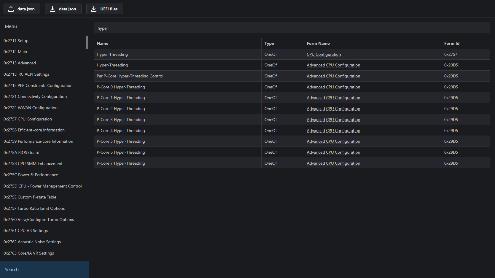
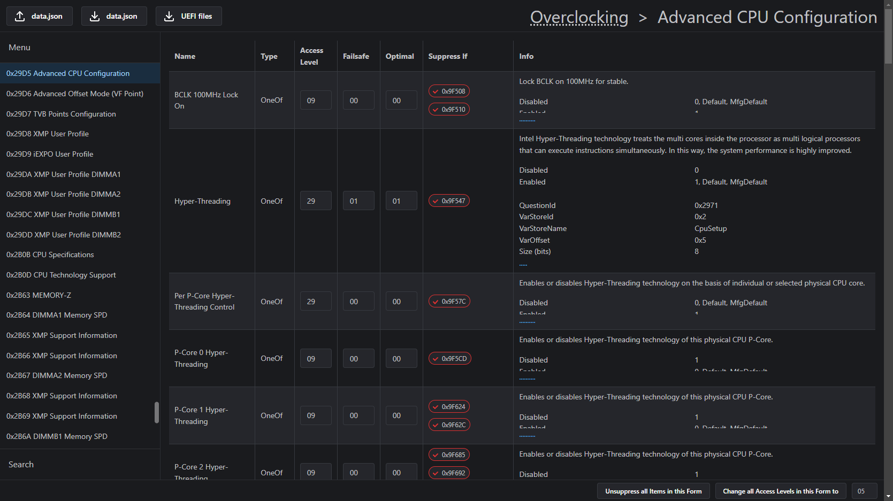

# Usage guide

## Prerequisites

- [UEFITool NE](https://github.com/LongSoft/UEFITool/releases) (press `Show all assets`)
- [UEFITool 0.28.0](https://github.com/LongSoft/UEFITool/releases/tag/0.28.0) ([why?](https://github.com/LongSoft/UEFITool#known-issues))
- [IFR Extractor](https://github.com/LongSoft/IFRExtractor-RS/releases)
- [UEFI Editor](https://boringboredom.github.io/UEFI-Editor/)

## Extracting the necessary files

- Drag and drop the BIOS file into `UEFITool NE`.
- Search (`CTRL + F`) for a known setting.

  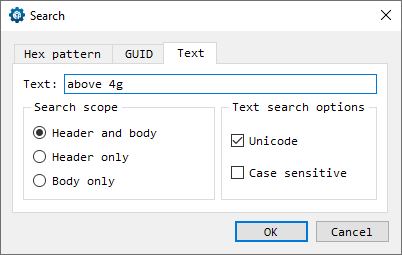

- Double-click the reference to `Setup/PE32 image section` at the bottom.

  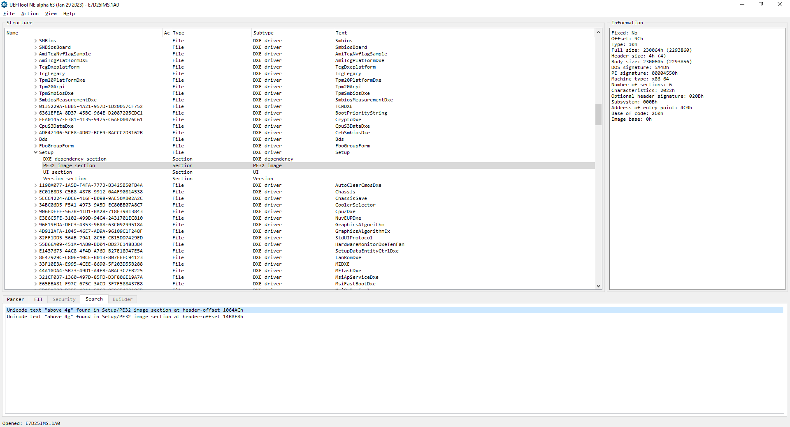

- Extract `PE32 image section` `as is`.

  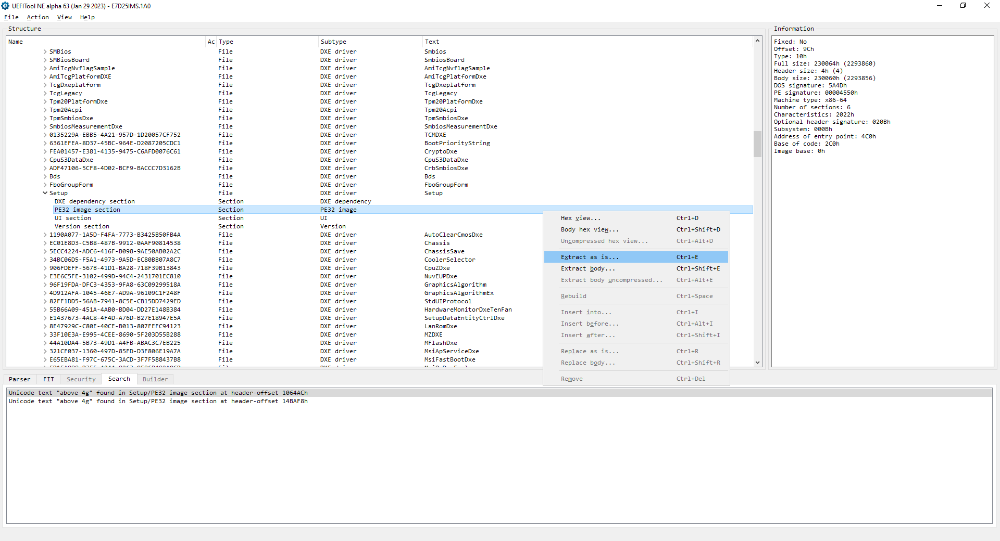

- Move `ifrextractor.exe` to the current folder, open the CLI inside and convert the `.sct` file you just extracted.

  ```
  ifrextractor.exe "Section_PE32_image_Setup_Setup.sct" verbose
  ```

  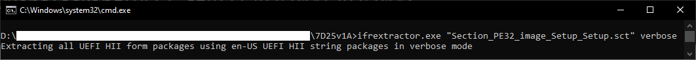

- Scroll down inside the currently expanded section and find `AMITSE` and `setupdata` (sometimes both required files are under `AMITSE`). Extract `PE32 image section` `as is` and `setupdata` as `body`.

  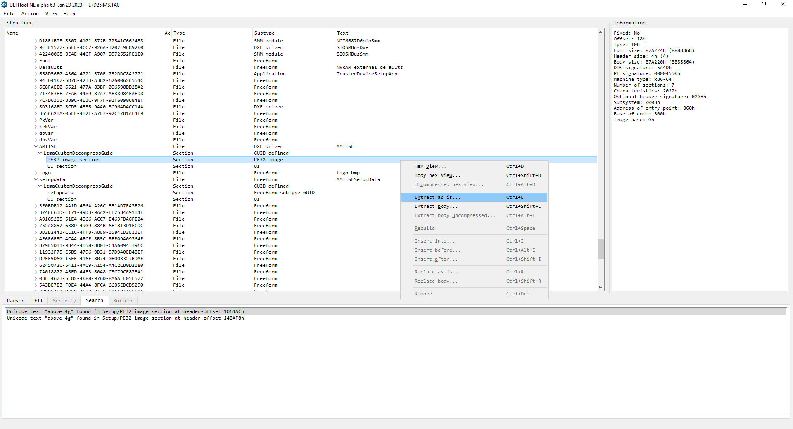
  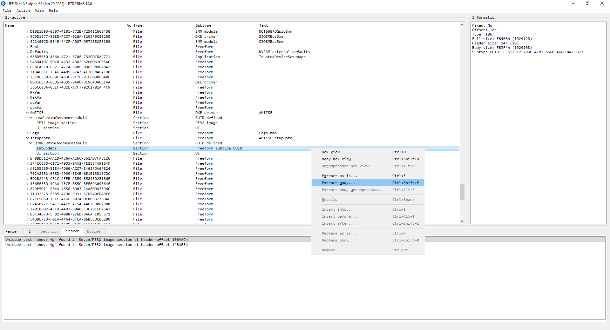

- Upload the 4 files to the `UEFI Editor` page.

  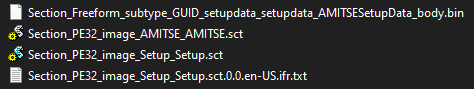

## Using the UEFI Editor GUI

- ### Navigation
  - Dotted underlined text has references to Forms and can be clicked.
- ### Menu

  - You can change the target Form of top-level references here. This is useful for UEFIs that have a custom `Advanced` Form.

    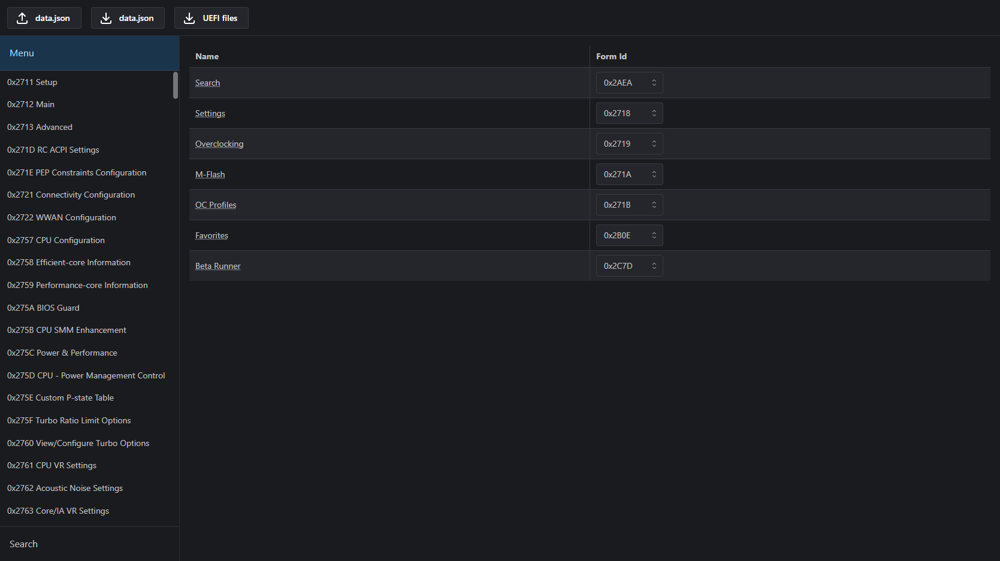
    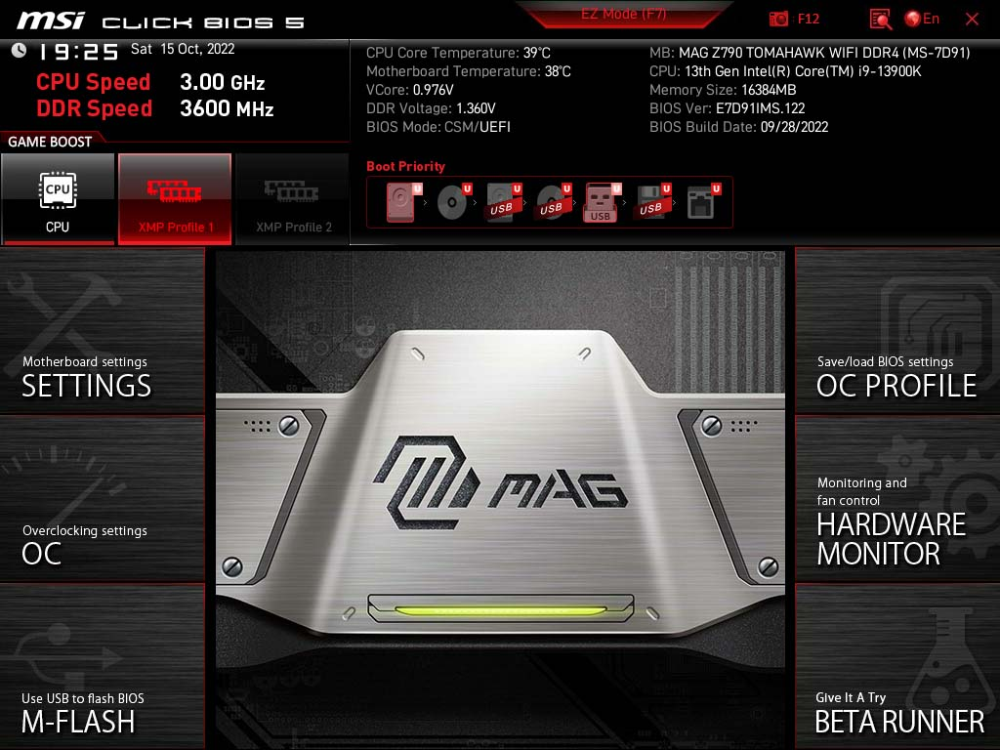

  - E.g. on MSI boards, you can replace `OC Profiles` with `Advanced` (child of `Setup`) to gain access to a lot of Forms that are otherwise inaccessible due to missing references while still retaining access to `OC Profiles`. Press `ESC` after selecting `OC Profiles` to access `Setup`.

- ### Item visibility control

  - Make sure the parent forms are visible when targeting a setting. Use the top-right navigation to travel upwards.
  - If one method doesn't work, try the other one. Using both at the same time can cause issues. It varies from UEFI to UEFI. Try modifying `Access Level` first.
  - #### Suppress If

    - A `Suppress If` opcode hides nested items if the condition is true. The presence of a `Suppress If` opcode doesn't always mean the condition is true. However, if it is, you can remove the suppression by unchecking the offset.

      

  - #### Access level

    - Another method of controlling item visibility is changing the access level. `05` usually works. A different value does not necessarily mean it's hidden. [Here is a forum post by Lost_N_BIOS with possible access level values](https://winraid.level1techs.com/t/request-maximus-xi-hero-unlock-amibcp/33743/4) (`CTRL + F` `05/Yes`).

      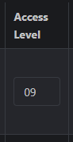

## Inserting modified files

- Press the `UEFI Files` download button to download the modified files and the change log.
- To find the correct sections in `UEFITool 0.28.0` you can search for `File GUID`s you copy from `UEFITool NE`.
- Replace files the same way you extracted them: `Extract as is` -> `Replace as is` and `Extract body` -> `Replace body`

  Example for `Setup/PE32 image section`:

  `UEFITool NE`:

  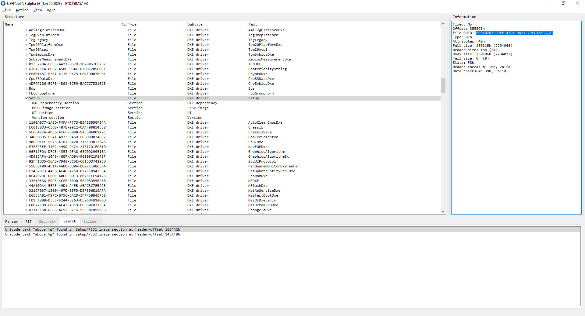

  `UEFITool 0.28.0`:

  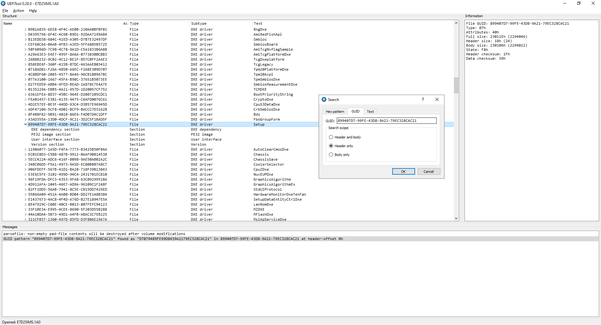
  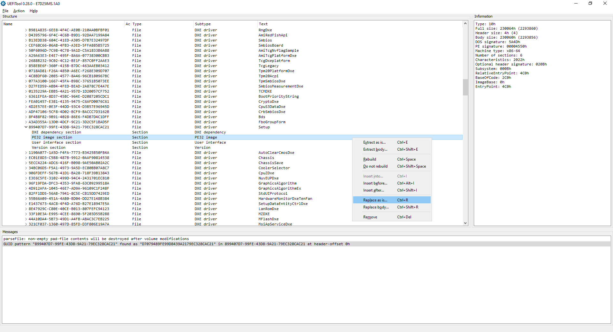

- Save the modifications.

  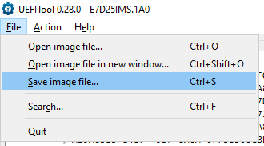

---

The section below is unrelated to the above tool.

---

# How to change hidden settings without flashing a modded BIOS

## Preparation

Download [datasone's modded shell](https://github.com/datasone/grub-mod-setup_var/releases) and rename it to `BOOTX64.EFI`.

Format a USB drive as `FAT32` and move `BOOTX64.EFI` to `USB:\EFI\BOOT\` (create the folders `EFI` and `BOOT` manually). The final path of the shell will be `USB:\EFI\BOOT\BOOTX64.EFI`.

Download your **_current_** BIOS version from the motherboard vendor's site. The structure changes across different versions, so make sure you have the **_same_** BIOS.

Follow [these instructions](#extracting-the-necessary-files) until and including the conversion with `ifrextractor.exe`.

Optionally, download [IFR-Formatter.js](https://raw.githubusercontent.com/BoringBoredom/UEFI-Editor/master/IFR-Formatter/IFR-Formatter.js) (right-click and `Save link as...`) and [node.exe](https://nodejs.org/dist/latest/win-x64/node.exe). Place them in the same folder as the IFR Extractor output and execute `node IFR-Formatter.js yourIfrExtractorOutput.txt` in the CLI.

Disable `Secure Boot` and `CSM` and boot from the USB drive in UEFI mode.

## Example

### IFR Extractor output

```
OneOf Prompt: "Intel C-State", Help: "[...]", QuestionFlags: [...], QuestionId: [...], VarStoreId: 0x2, VarOffset: 0x14, Flags: [...], Size: 8, Min: [...], Max: [...], Step: [...] { [...] }
	OneOfOption Option: "Auto" Value: 2, Default, MfgDefault { [...] }
	OneOfOption Option: "Enabled" Value: 1 { [...] }
	OneOfOption Option: "Disabled" Value: 0 { [...] }
End  { 29 02 }
```

`Size` is a decimal in bits. Convert it to a hexadecimal in bytes.  
`Value` is a decimal. Convert it to a hexadecimal.

Search for the `VarStoreId` to find the `VarStoreName`.

```
VarStore Guid: [...], VarStoreId: 0x2, Size: [...], Name: "CpuSetup" { [...] }
```

### IFR-Formatter.js output

```
Intel C-State | VarStore: CpuSetup | VarOffset: 0x14 | Size: 0x1
    Auto: 0x2
    Enabled: 0x1
    Disabled: 0x0
```

### [Syntax](https://github.com/datasone/grub-mod-setup_var#setup_var_cv) (READ THIS)

#### Writing

```
setup_var_cv VarStoreName VarOffset Size Value
```

```
setup_var_cv CpuSetup 0x14 0x1 0x0
```

#### Reading

```
setup_var_cv VarStoreName VarOffset Size
```

```
setup_var_cv CpuSetup 0x14 0x1
```

### Miscellaneous

To exit and reboot, type:

```
reboot
```

---

Workarounds for various issues (e.g. multiple `Setup` `VarStores`): [legacy commands](https://github.com/datasone/grub-mod-setup_var#legacy-commands)

---

If something unexpected happens, force shutdown and reset CMOS.
